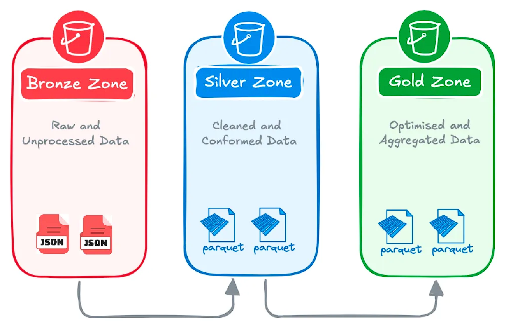
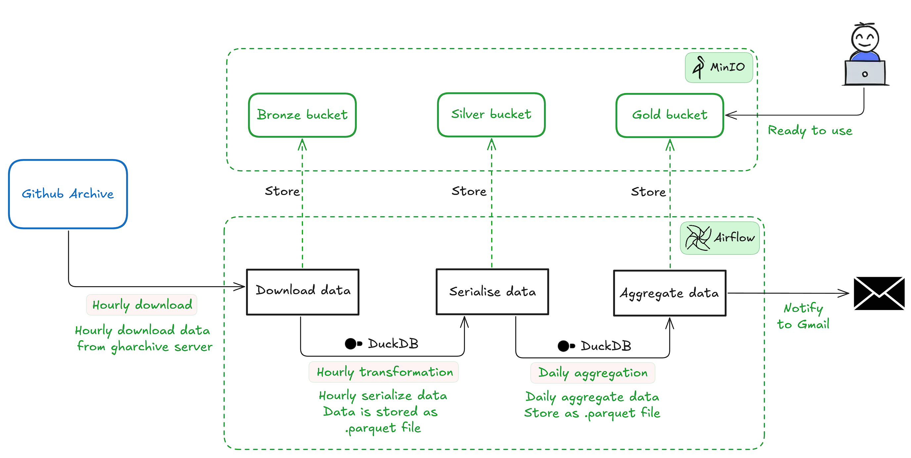

```
 $$$$$$\  $$\   $$\            $$$$$$\                      $$\             $$\     $$\                             $$\   $$\           $$\       
$$  __$$\ \__|  $$ |          $$  __$$\                     $$ |            $$ |    \__|                            $$ |  $$ |          $$ |      
$$ /  \__|$$\ $$$$$$\         $$ /  $$ |$$$$$$$\   $$$$$$\  $$ |$$\   $$\ $$$$$$\   $$\  $$$$$$$\  $$$$$$$\         $$ |  $$ |$$\   $$\ $$$$$$$\  
$$ |$$$$\ $$ |\_$$  _|$$$$$$\ $$$$$$$$ |$$  __$$\  \____$$\ $$ |$$ |  $$ |\_$$  _|  $$ |$$  _____|$$  _____|$$$$$$\ $$$$$$$$ |$$ |  $$ |$$  __$$\ 
$$ |\_$$ |$$ |  $$ |  \______|$$  __$$ |$$ |  $$ | $$$$$$$ |$$ |$$ |  $$ |  $$ |    $$ |$$ /      \$$$$$$\  \______|$$  __$$ |$$ |  $$ |$$ |  $$ |
$$ |  $$ |$$ |  $$ |$$\       $$ |  $$ |$$ |  $$ |$$  __$$ |$$ |$$ |  $$ |  $$ |$$\ $$ |$$ |       \____$$\         $$ |  $$ |$$ |  $$ |$$ |  $$ |
\$$$$$$  |$$ |  \$$$$  |      $$ |  $$ |$$ |  $$ |\$$$$$$$ |$$ |\$$$$$$$ |  \$$$$  |$$ |\$$$$$$$\ $$$$$$$  |        $$ |  $$ |\$$$$$$  |$$$$$$$  |
 \______/ \__|   \____/       \__|  \__|\__|  \__| \_______|\__| \____$$ |   \____/ \__| \_______|\_______/         \__|  \__| \______/ \_______/ 
                                                                $$\   $$ |                                                                        
                                                                \$$$$$$  |                                                                        
                                                                 \______/                                                                         
```
## Description
Git-Analytics-Hub is a tool that automates the collection, processing, and storage of GitHub Archive data, which provide a full record of GitHub activities for public repositories. It runs hourly to download raw data from GitHub Archive. Then, it processes the raw data and aggregates the processed data, both using DuckDB. All the data is stored in MinIO for further analytics.

## Architecture
Git-Analytics-Hub uses muti-tier architecture - the **Medallion Architecture** - which is a data lake design pattern that organises data into three zones:
- **Bronze Zone**: Containing raw, unprocessed data ingested from various sources.
- **Silver Zone**: Containing cleaned, conformed and potentially modeled data.
- **Gold Zone**: Containing aggregated and curated data ready for reporting, dashboards, and advanced analytics.



Each zone in Git-Analytics-Hub is responsible for the following:
- **Bronze Zone**: Stores raw data from [GitHub Archive](https://www.gharchive.org/) data in Minio.
- **Silver Zone**: Stores processed data as `.parquet` file. Data is processed by selecting only need fields using DuckDB
- **Gold Zone**: Stores aggregated data as `.parquet` files. Data is aggregated for each day using DuckDB, ready for downstream use.

The workflow is managed using Apache Airflow, ensuring automated and scheduled data processing.



## Installation

### Prerequisites
Ensure you have the following installed:
- **Docker** (tested with version `28.0.1`)
- **Docker Compose** (tested with version `2.33.1`)
- **Python** (tested with version `3.10.15`)

### Setup
Clone the repository and navigate to the project directory:
```sh
git clone https://github.com/viethung1234q/git_analytics_hub.git
cd git_analytics_hub
```

## Usage

### First-time setup:
Initialize Airflow before running the services:
```sh
docker compose up airflow-init
```
Then, start the services:
```sh
docker compose up --build -d
```
To enable email notifications from Airflow, configure both the sender and receiver email addresses.
Set the sender address in the `.env` file:
```sh
AIRFLOW__SMTP__SMTP_MAIL_FROM=your_email@example.com
```
Update the recipient address in the `dag_git_analytics_hub.py` file:
```sh
send_email(
    to=["your_email@example.com"],  # Replace with your actual email
    ...
)
```

Finally, create a new SMTP connection in the Airflow UI.

### Subsequent runs:
For all future runs, simply use:
```sh
docker compose up -d
```

### Stop:
To stop services:
```sh
docker compose down
```

## Configuration

### Environment Variables
Environment variables are defined in the `.env` file:
```ini
AIRFLOW_UID=1000
AIRFLOW__WEBSERVER__EXPOSE_CONFIG=true
AIRFLOW__SCHEDULER__CATCHUP_BY_DEFAULT=false
...
```

### Project Configuration
Project-specific configurations are stored in `git_analytics_hub/src/config.ini`:
```ini
[minio]
access_key = minioadmin
secret_key = minioadmin
...
```

## Additional Notes
- Airflow DAGs are configured to run hourly, processing GitHub Archive data.
- Minio is used as object storage for raw and processed data.
- DuckDB serves as the query engine for data transformations.

For detailed documentation and contributions, refer to the official repository.
